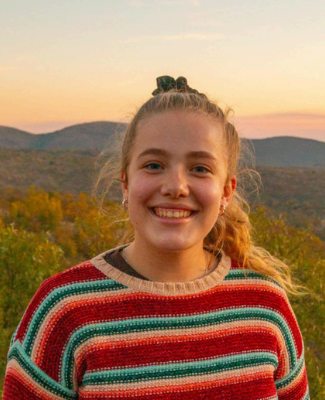
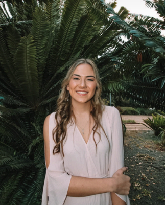
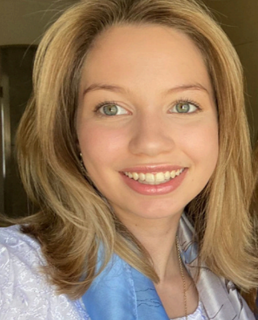
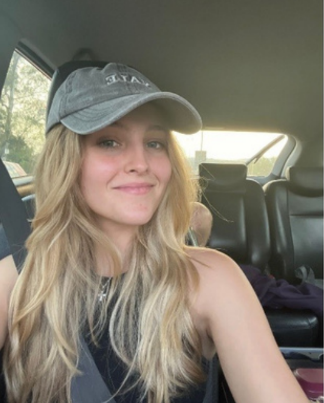

# Culinary Companion

<!-- 

[][url-to-point-to] -->

<!--  -->

# TeckTonic - Culinary Companion
# Table of contents

- [Table of contents](#table-of-contents)
- [Summary](#summary)
- [Introduction](#introduction)
- [Demo Video](#demo-video)
- [Here are the links to our Documentation](#here-are-the-links-to-our-documentation)
- [Our Tech stack](#our-tech-stack)
- [The Version control and CI/CD Utilized](#the-version-control-and-cicd-utilized)
- [Meet The Team](#meet-the-team)

# Summary
Culinary Companion is a Progressive Web Application (PWA) designed to function as a virtual sous-chef. It uses large language models (LLMs) and food science to suggest ingredient substitutions and recipe modifications based on available ingredients or dietary constraints of a user.

# Introduction

Introduction - click to expand

Culinary Companion is a project designed to offer users an enriched culinary experience. It serves as a platform for users to manage their recipes, plan meals, and discover new culinary trends. The application focuses on core features such as creating and sharing recipes, meal planning, and exploring trending culinary topics, aiming to provide users with a seamless and enjoyable culinary experience.

Designed with a wide range of users in mind, Culinary Companion features a user-friendly interface and intuitive navigation, ensuring accessibility for both novice and experienced culinary enthusiasts. Whether users are looking to organize their favorite recipes, plan their weekly meals, or discover new culinary ideas, Culinary Companion offers a dynamic platform to support these activities.

As a project committed to continuous improvement and user satisfaction, Culinary Companion evolves based on user feedback and emerging culinary trends. With a mission to empower users to enhance their culinary skills and enjoy cooking, Culinary Companion stands as a valuable resource in the culinary landscape.

# Demo Video

<a href="[hhttps://drive.google.com/file/d/15_5Z1gA2fE5ary6gUPKAXGd8STM5MKtF/view?usp=sharing](https://drive.google.com/file/d/15_5Z1gA2fE5ary6gUPKAXGd8STM5MKtF/view?usp=drive_link)">Demo 1</a> 
<!-- <a href="">Demo 2</a>  -->

# Here are the links to our Documentation

<a href="https://drive.google.com/drive/u/0/folders/1ZnmKO3qS6L-8hnpoZXd2Y9Ym1cz955pI">Google Drive (For Dev purposes)</a> 
<a href="https://drive.google.com/file/d/1S89jOO6uwtdGO69uQlcny6oqonXwpjXO/view">System Requirements (SRS)</a> 
<a href ="https://docs.google.com/document/d/1jnSFyKLy5eKni1W7SQXsAEFjbcDD9z4gKG0Ik5CG4Ns/edit?usp=sharing">Github Strategy</a> 
<a href="https://www.figma.com/design/arOZQVX3lf29HQ8i4AX62q/Culinary-Companion-Wireframe?node-id=0-1&t=RlUZKlPywj5BnrZA-1">Figma designs</a> 
<a href="https://github.com/orgs/COS301-SE-2024/projects/58">GitHub Project Board</a> 
<a href="https://docs.google.com/document/d/1g2y0eYqlM3KTqKUrnQyZ14FAw0r3NWiBiadqF8cziJQ/edit?usp=sharing">Testing Guidelines</a> 

# Our Tech stack

  

# The Version control and CI/CD Utilized

  

# Meet The Team

| Name and Surname             | Github Profiles                                                                                           | LinkedIn Profile                                 | Roles                  | Bio                                                                                                                                                                                                                                                                                                                                                                                                                                                             | Profile Image                                                                |
| :--------------------------- | --------------------------------------------------------------------------------------------------------- | -------------------------------------------------------------------------------------------------------------- | :--------------------- | :-------------------------------------------------------------------------------------------------------------------------------------------------------------------------------------------------------------------------------------------------------------------------------------------------------------------------------------------------------------------------------------------------------------------------------------------------------------- | ---------------------------------------------------------------------------- |
| Tessa Engelbrecht            |                             | [LinkedIn](www.linkedin.com/in/tessa-engelbrecht-050554209)                                                    | Project Manager        | As a project manager, I thrive on building strong relationships with my team members. My passion lies in getting to know each individual's strengths and working collaboratively to leverage those talents effectively. I prioritise regular team meetings to ensure clear communication, alignment, and understanding of expectations.                                                                                                                         |                       |
| Janicke Jacobs            |                              | [LinkedIn](https://www.linkedin.com/in/janicke-jacobs-498a242b5/)                                                    | Designer and UI Engineer       | Janicke is a 3rd year Information and Knowledge Systems student at the University of Pretoria, specializing in Data Science. She has experience in Java, C++, ReactJS, HTML, R and SAS, and is always keen to learn new languages. She is hardworking and as a perfectionist tries to display that in her daily work.                                                                                                                                                                                                                                                                                                                                                                                                                                     |                        |
| Teresa Park                |                              | [LinkedIn](https://www.linkedin.com/in/teresa-park-3b92b42b9/)                                                        | BA and Database Engineer               | I am currently a student at the University of Pretoria pursuing my third year of a Bachelors in Computer Science. Throughout my academic journey I have developed a strong foundation in programming languages such as Java, Python, and C++.  My passion lies in Database Management and Design, AI and Software Engineering.                                                                             |                        |
| Layla Olivier        |                              | [LinkedIn](https://www.linkedin.com/in/layla-olivier-995053306/)                                     | LLM and Services Engineer            | I'm a passionate UI engineer deeply immersed in the world of creative design and user experience. With a strong background in Computer Science, currently in my third year of study, I excel in designing user-friendly digital interfaces that skillfully merge aesthetics with functionality. With a keen eye for detail and a commitment to innovation, I'm dedicated to creating captivating experiences that resonate with users across diverse platforms. |                        |
| Julia Ortner |                              | [LinkedIn](https://www.linkedin.com/in/julia-ortner-a78340277/)                             | Designer and Integration Engineer   | Hey there I'm Julia, a final year Computer Science student at the University of Pretoria. I have a huge interest in art and design and am naturally drawn to the front-end side of software development.                                                                                                                                                                                                                                                                                                                                                                                                                                  |                        |
