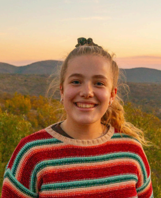
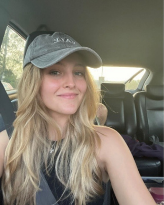

# Culinary Companion

<!--  -->

# TeckTonic - Culinary Companion
# Table of contents

- [Table of contents](#table-of-contents)
- [Summary](#summary)
- [Introduction](#introduction)
- [Demo Video](#demo-video)
- [Here are the links to our Documentation](#here-are-the-links-to-our-documentation)
- [Our Tech stack](#our-tech-stack)
- [The Version control and CI/CD Utilized](#the-version-control-and-cicd-utilized)
- [Meet The Team](#meet-the-team)

# Summary
Culinary Companion is a Progressive Web Application (PWA) designed to function as a virtual sous-chef. It uses large language models (LLMs) and food science to suggest ingredient substitutions and recipe modifications based on available ingredients or dietary constraints of a user.

# Introduction

Introduction - click to expand

Culinary Companion is a project designed to offer users an enriched culinary experience. It serves as a platform for users to manage their recipes, plan meals, and discover new culinary trends. The application focuses on core features such as creating and sharing recipes, meal planning, and exploring trending culinary topics, aiming to provide users with a seamless and enjoyable culinary experience.

Designed with a wide range of users in mind, Culinary Companion features a user-friendly interface and intuitive navigation, ensuring accessibility for both novice and experienced culinary enthusiasts. Whether users are looking to organize their favorite recipes, plan their weekly meals, or discover new culinary ideas, Culinary Companion offers a dynamic platform to support these activities.

As a project committed to continuous improvement and user satisfaction, Culinary Companion evolves based on user feedback and emerging culinary trends. With a mission to empower users to enhance their culinary skills and enjoy cooking, Culinary Companion stands as a valuable resource in the culinary landscape.

# Demo Video

<a href="https://drive.google.com/file/d/15_5Z1gA2fE5ary6gUPKAXGd8STM5MKtF/view?usp=sharing">Demo 1</a> 
<a href="https://drive.google.com/file/d/1V_g0KkcuujZR5V86HbeliEnzHzAhgSkR/view?usp=sharing">Demo 2</a> 
<a href="https://drive.google.com/file/d/1nwWkCSMbDmbQ0SQXtcBWU9rSVNt_obrt/view?usp=sharing">Demo 3</a> 
<a href="https://drive.google.com/file/d/1IGajpOF9SY4D0nETkcBsR0SHE2AW9wlv/view?usp=sharing">Demo 4</a> 
<!-- <a href="">Demo 2</a>  -->

# Here are the links to our Documentation

<a href="https://drive.google.com/drive/u/0/folders/1J3UkGzdmvfzHlvo3s3H9XGm8tCHz1Uby">Google Drive (For Dev purposes)</a> 
<a href="https://docs.google.com/document/d/15BmymzqP6uVTuVqwOn0Yr3DsMgQYDttUQXpStN8uthY/edit">System Requirements (SRS)</a> 
<a href ="https://docs.google.com/document/d/1jnSFyKLy5eKni1W7SQXsAEFjbcDD9z4gKG0Ik5CG4Ns/edit?usp=sharing">Github Strategy</a> 
<a href="https://www.figma.com/design/arOZQVX3lf29HQ8i4AX62q/Culinary-Companion-Wireframe?node-id=0-1&t=RlUZKlPywj5BnrZA-1">Figma designs</a> 
<a href="https://github.com/orgs/COS301-SE-2024/projects/58">GitHub Project Board</a> 
<a href="https://docs.google.com/document/d/1ZoVi9KfAVdYJh_LYhZx1c4JbL_N_GcJW1Ux66Hivqok/edit">Testing Guidelines</a> 
<a href="https://docs.google.com/document/d/1XVFKQBNgAKO-0a8WxgVJc_MtoPRM8112bPF1p04mdIs/edit">Architectural requirements</a> 
<a href="https://docs.google.com/document/d/1q83kjc26SDcv6gT9tssgXCbJLZIAMjvUQ0csrpDg_dg/edit#heading=h.guha62j8eqgf">Coding Standards</a> 
<a href="https://drive.google.com/drive/u/0/folders/1J3UkGzdmvfzHlvo3s3H9XGm8tCHz1Uby">User Manual</a> 
<a href="https://docs.google.com/document/d/1tnc2obcVK6tWu-XDuHJx8DG9czl4Mv55UhOr-jQdhVY/edit">Design Specification</a> 
<a href="https://docs.google.com/document/d/1TtUSZpYhsh_iInPwA0NXK4ulTC5MQL7r3TyqDy5_5rg/edit#heading=h.guha62j8eqgf">Technical Installation Manual</a> 
  <a href="https://docs.google.com/document/d/11qPYwyVB8KJonYqkCW78GCDqaoV_rP52/edit?usp=sharing&ouid=102858177285156656233&rtpof=true&sd=true">LLM Decisions</a> 
  <a href="https://docs.google.com/document/d/1LgrV6KfBaQ7jbH0I2oQmZ9g1dJnnBALD/edit?usp=sharing&ouid=102858177285156656233&rtpof=true&sd=true">Gemini Prompt Engineering </a> 
  <a href="https://drive.google.com/file/d/1_F9IM3ZkZygTar6c8lDQO6WmJa-2qDgp/view?usp=drive_link">Deployment Diagram </a> 

# Our Tutorial/Advert video and powerpoint
<a href="https://drive.google.com/file/d/1hl1uZmiUAvkELDTCuX9VwEh6pUHGx2M4/view?usp=sharing">App Video</a> 

<a href="https://docs.google.com/presentation/d/1ZNNElym4C06PZim49WbdmK-Au5C9sk1e/edit?usp=drive_link&ouid=105545363334266538391&rtpof=true&sd=true">Powerpoint</a> 

<a href="https://www.canva.com/design/DAGUIo3ANfU/4-mUj_Fm3uM_nReb5uAnWg/view?utm_content=DAGUIo3ANfU&utm_campaign=designshare&utm_medium=link&utm_source=editor">Canva Link to Powerpoint</a> 

# Our Tech stack

  

# The Version control and CI/CD Utilized

  

# Culinary Companion - Progressive Web App (PWA)

Welcome to **Culinary Companion**, your personalized dietary and cooking assistant. This guide will help you download and install the app on both mobile and desktop, as well as provide instructions for those interested in contributing to the development of the project.

## How to Download and Install on Mobile

### Android
1. Open [Culinary Companion](https://culinary-companion-capstone.netlify.app) in Chrome or your preferred browser.
2. You should see a prompt at the bottom of your screen asking if you want to add Culinary Companion to your home screen.
3. Tap on the prompt or the browser menu (three dots in the top-right corner) and select **"Add to Home Screen"**.
4. The app will now appear on your home screen like a native app.

### iOS (iPhone/iPad)
1. Open [Culinary Companion](https://culinary-companion-capstone.netlify.app) in Safari.
2. Tap the **Share** icon (the square with an arrow pointing up at the bottom of your screen).
3. Scroll down and tap **"Add to Home Screen"**.
4. The app will now be added to your home screen.

## How to Download and Install on Desktop

1. Open [Culinary Companion](https://culinary-companion-capstone.netlify.app) in Chrome or Edge.
2. Click on the install icon in the browser's address bar or navigate to the browser menu (three dots).
3. Select **"Install Culinary Companion"**.
4. The app will be added to your desktop as a standalone application.

---

## How to Contribute to the Development

We welcome contributions to Culinary Companion! To get started, follow the instructions in our **Technical Installation Manual**.

### Steps to Participate
1. Review the installation and setup guide available in the [Technical Installation Manual](https://docs.google.com/document/d/1TtUSZpYhsh_iInPwA0NXK4ulTC5MQL7r3TyqDy5_5rg/edit?usp=sharing).
2. Ensure you have the necessary tools and environment configured as per the documentation.
3. Clone the project repository and follow the steps to run it locally.
4. Submit any changes or improvements through pull requests.

Your contributions will help enhance Culinary Companion, making it a better experience for everyone!

Feel free to reach out if you need any help getting set up or contributing, tecktonic.capstone@gmail.com.

Happy cooking and coding! 👩‍🍳👨‍🍳

# Meet The Team

| Name and Surname             | Github Profile                                                                                           | LinkedIn Profile                                 | Roles                  | Bio                                                                                                                                                                                                                                                                                                                                                                                                                                                             | Profile Image                                                                |
| :--------------------------- | --------------------------------------------------------------------------------------------------------- | -------------------------------------------------------------------------------------------------------------- | :--------------------- | :-------------------------------------------------------------------------------------------------------------------------------------------------------------------------------------------------------------------------------------------------------------------------------------------------------------------------------------------------------------------------------------------------------------------------------------------------------------- | ---------------------------------------------------------------------------- |
| **Tessa Engelbrecht**            |                             | [LinkedIn](www.linkedin.com/in/tessa-engelbrecht-050554209)                                                    | Project Manager, Testing Engineer, Dev Ops        | As a project manager, I thrive on building strong relationships with my team members. My passion lies in getting to know each individual's strengths and working collaboratively to leverage those talents effectively. I prioritize regular team meetings to ensure clear communication, alignment, and understanding of expectations.                                                                                                                                         |                       |
| [CV](https://drive.google.com/file/d/1p20EXRHf_2XQFLRpzqQAA2SE_XOcbE8G/view?usp=sharing) | [Email](mailto:tessa.engelbrecht@gmail.com)                                                                                                                                                                                                                                                                                                                                                                                                                                                                                                  
| **Janicke Jacobs**            |                              | [LinkedIn](https://www.linkedin.com/in/janicke-jacobs-498a242b5/)                                                    | Designer and UI Engineer       | I am currently in my third year of the Information and Knowledge Systems degree at the University of Pretoria, specializing in Data Science. Over the past three years, I have gained experience in Java, C++, ReactJS, HTML, R, SAS, and Flutter, and I am always eager to learn new programming languages. I have a strong interest in the frontend side of website design, databases, and statistics. I am hardworking and have a perfectionistic mindset, which is evident in my daily work.                                                                                                                                                                    |                        |
| [CV](https://drive.google.com/file/d/1sV6oUNQXvUgyy8aFdVkgWyBW_cTQ0_xp/view?usp=sharing) | [Email](mailto:JacobsJanicke@gmail.com)                                                                                                                                                                                                                                                                                                                                                                                                                                                                 
| **Teresa Park**                |                              | [LinkedIn](https://www.linkedin.com/in/teresa-park-3b92b42b9/)                                                        | Business Analyst, Integration Engineer, Database Engineer               | I am a third-year Computer Science student at the University of Pretoria with a strong foundation in Java, Python, and C++, and a passion for Database Management, AI, and Software Engineering. Through coursework, personal projects, and group collaborations, I have gained practical experience in PDF scraping, web design, and mathematical problem-solving. I earned Golden Key in 2023 for academic excellence and taught Computer Literacy on the Mamaelodi campus as part of my JCP project. My roles as Business Analyst in a MiniProject and Integration and Database Engineer in a Capstone project have further enhanced my technical and communication skills.                                                                                                                                                                                   |                        |
| [CV](https://drive.google.com/file/d/1Xwy2HzhTttfA7Mo0erafyzuk3ScF57CO/view?usp=sharing) | [Email](mailto:teresamaripark@gmail.com)                                                                                                                                                                                                                                                                                                                                                                                                                                                                 
| **Layla Olivier**        |                              | [LinkedIn](https://www.linkedin.com/in/layla-olivier-995053306/)                                     | LLM and Services Engineer            | I'm a passionate UI engineer deeply immersed in creative design and user experience. Currently in my third year of Computer Science, I design user-friendly digital interfaces that skillfully merge aesthetics with functionality. I am dedicated to creating captivating experiences across diverse platforms.                                                                                                                   |                        |
| [CV](https://drive.google.com/file/d/1QyPOWnmbadej76sXGJ-2rElcuHU_uDqr/view?usp=sharing) | [Email](mailto:olivierlayla@gmail.com)                                                                                                                                                                                                                                                                                                                                                                                                                                                                
| **Julia Ortner** |                              | [LinkedIn](https://www.linkedin.com/in/julia-ortner-a78340277/)                             | Designer and Integration Engineer   | Third-year Computer Science student with a passion for frontend development and strong interpersonal skills. I bring a blend of technical expertise in coding and hands-on experience in the retail industry. As a creative individual, I thrive on designing innovative solutions, but I equally value teamwork and collaboration, always eager to contribute as part of a dynamic team.                                                                                                                                                                  |    |
| [CV](https://drive.google.com/file/d/1ljw31Ezh0PTnKiIgjaglxQvwkQu3mm8w/view?usp=sharing) | [Email](mailto:Julia.ortner711@gmail.com)                                                                                                                                                                                                                                                                                                                                                                                                                                                                                                                                                            
